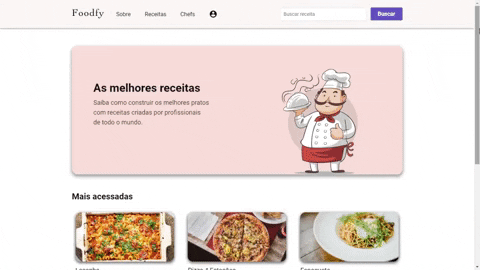
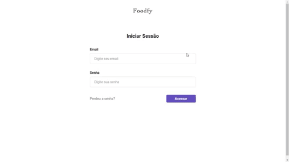

<h1 align='center'>
  
</h1>

<p align='center'></p>
  
<p align='center'>:plate_with_cutlery: Learn how to make the best recipes created by professionals from around the world!<p>

# :pushpin: Table of Contents

- [What do we create?](#construction_worker-what-do-we-create)
- [Getting started](#runner-getting-started)
- [Technologies](#computer-technologies)
- [License](#closed_book-license)

<br>
  
## :construction_worker: What do we create?

Foodfy is a complete web application for recipe management, developed on the [Rocketseat's](https://rocketseat.com.br) LaunchBase Bootcamp.

<p align="center">
  
</p>
<br>

<h3 align="center">Admin</h3>
<p align="center">
  
</p>

## :computer: Technologies

Some of the technologies and tools used in the project:

- [HTML](https://devdocs.io/html/)
- [CSS](https://devdocs.io/css/)
- [JavaScript](https://devdocs.io/javascript/)
- [Nunjucks](https://mozilla.github.io/nunjucks/)
- [NodeJS](https://nodejs.org/en/)
- [Nodemailer](https://nodemailer.com/about/)
- [Express](https://expressjs.com/)
- [Express Session](https://github.com/expressjs/session)
- [Multer](https://github.com/expressjs/multer)
- [PostgreSQL](https://www.postgresql.org/)
- [BcryptJS](https://github.com/dcodeIO/bcrypt.js)
- [Faker.js](https://github.com/Marak/Faker.js)

<br>

## :runner: Getting started

**You need to install [Node](https://nodejs.org/en/) and [Postgres](https://www.postgresql.org/).**

Follow the steps bellow:

```bash
# Open a terminal and copy this repository with the command
$ git clone https://github.com/Mateussv/Foodfy.git.

# Enter the directory with
$ cd foodfy

# Install dependencies
$ npm install

# Create the database and tables using the commands
# included in the "database.sql" file

# Database connection:
# Open and edit the "db.js" file inside the "src/config" folder
# with your Postgres user and password.

# Populate the database using the file "seed.js":
$ node seed.js

# Run the application:
$ npm start
```

**Important:** Do not delete or change the placeholder image directly from the `public/images' folder, as the revenues and chefs generated by `seed.js` share these files with each other. However, you can delete them from the administrative area of the site.

<br>

### Access to the administrative area

Select an email from the users table, access the login screen and enter using it with the password "1111" (default password).

Note: administrator users have the "ADMIN" badge in their header:
<p align="center">
  
</p>

<br>

### Creating New Users and Password Recovery
To use these features, edit the mailer.js file inside the scr/lib folder with your credentials.
<br><br>

This project is under the [MIT license](https://github.com/Mateussv/Foodfy/blob/master/LICENSE).
